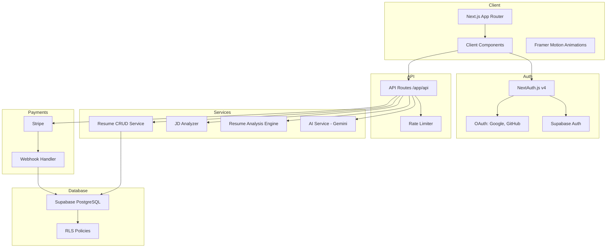

<div align="center">

# AI Resume Builder & Analyzer

**Build, analyze, and optimize resumes with AI assistance.**

[](https://nextjs.org/)
[](https://www.typescriptlang.org/)
[](https://tailwindcss.com/)
[](https://supabase.com/)
[](https://next-auth.js.org/)
[](https://stripe.com/)
[](https://ai.google.dev/)
[]()

[Features](#features) • [Architecture](#architecture) • [Getting Started](#getting-started) • [API Documentation](#api-documentation) • [Deployment](#deployment)

</div>

---

## Table of Contents

- [Features](#features)
- [Tech Stack](#tech-stack)
- [Architecture](#architecture)
- [Folder Structure](#folder-structure)
- [Getting Started](#getting-started)
  - [Prerequisites](#prerequisites)
  - [Installation](#installation)
  - [Environment Variables](#environment-variables)
  - [Running Locally](#running-locally)
  - [Available Scripts](#available-scripts)
  - [Build & Production](#build--production)
- [Deployment](#deployment)
- [API Documentation](#api-documentation)
- [Usage Examples](#usage-examples)
- [Testing](#testing)
- [Linting & Formatting](#linting--formatting)
- [Security Notes](#security-notes)
- [Performance Optimizations](#performance-optimizations)
- [Troubleshooting](#troubleshooting)
- [Roadmap](#roadmap)
- [Known Issues](#known-issues)
- [Contributing](#contributing)
- [License](#license)
- [Acknowledgements](#acknowledgements)

---

## Features

### ✍️ AI-Powered Resume Builder
- **Smart Writing Assistant** — AI generates professional summaries, enhances bullet points, checks grammar, and suggests achievements using Google Gemini 2.0 Flash. No fabricated metrics — prompts explicitly forbid hallucination.
- **4 Professional Templates** — Choose from Modern, ATS Professional, Student, and Minimal. Each template is designed to pass Applicant Tracking Systems.
- **GitHub Auto-Import** — Connect your GitHub account and import repositories with one click. Projects, descriptions, and tech stacks populate automatically.
- **Cover Letter Generator** — Generate tailored cover letters from your resume and a job description.

### 🔍 Resume Analysis & Optimization
- **ATS Scoring Engine** — Proprietary local engine scores resumes across 5 dimensions: keyword relevance (30%), readability (20%), formatting (20%), section completeness (15%), and contact info (15%). No external API calls needed for basic scoring.
- **Job Description Matching** — Paste a job description to extract keywords, identify skill gaps, and get a match percentage between your resume and the role.
- **Resume File Upload** — Upload PDF, DOCX, or TXT files. The parser extracts text, sections, email, phone, and links automatically.
- **Grammar & Strength Analysis** — Built-in grammar checker and strength report generate actionable recommendations.

### 🔄 Resume Variants
- **Role-Tailored Versions** — Rewrite your resume to emphasize skills relevant to a specific role type.
- **Company-Culture Versions** — Tailor your resume to match different company cultures (startup, enterprise, agency, etc.).

### 💳 Subscription Plans
| Plan | Price | Key Limits |
|------|-------|------------|
| **Free** | $0 | 1 resume, 20 AI actions/mo, 3 ATS checks, 3 JD analyses |
| **Pro** | $12/mo or $90/yr | Unlimited resumes, unlimited AI actions, all templates, PDF export, priority support |

Stripe handles payments, webhooks, and customer portal. Usage limits reset monthly.

### 👤 User Onboarding
- Two-step onboarding collects user type (student / experienced) and career goals (desired role, industry, salary range, work type preferences).
- Profile data feeds into AI suggestions for better-tailored output.

---

## Tech Stack

| Layer | Technology |
|-------|-----------|
| **Framework** | [Next.js 14](https://nextjs.org/) (App Router) |
| **Language** | [TypeScript](https://www.typescriptlang.org/) 5.4 |
| **Styling** | [Tailwind CSS](https://tailwindcss.com/) 3.4 + custom design tokens |
| **Database** | [PostgreSQL](https://www.postgresql.org/) via [Supabase](https://supabase.com/) |
| **Authentication** | [NextAuth.js](https://next-auth.js.org/) 4.24 (JWT strategy) + [Supabase Auth](https://supabase.com/auth) |
| **Auth Providers** | Google OAuth, GitHub OAuth, Email/Password (credentials) |
| **AI Engine** | [Google Gemini 2.0 Flash](https://ai.google.dev/) (free tier) |
| **Payments** | [Stripe](https://stripe.com/) (checkout, subscriptions, webhooks, customer portal) |
| **Animation** | [Framer Motion](https://www.framer.com/motion/) 11 |
| **Icons** | [Lucide React](https://lucide.dev/) + [React Icons](https://react-icons.github.io/react-icons/) |
| **Document Parsing** | `mammoth` (DOCX), `pdf-parse` (PDF) |
| **Utilities** | `clsx` + `tailwind-merge` for class merging, `crypto.randomUUID()` for ID generation |
| **Linting** | ESLint with `next/core-web-vitals` + `next/typescript` |
| **Runtime** | Node.js 18+ (`.nvmrc` specifies Node 18) |
| **Package Manager** | npm |

---

## Architecture



### Design Patterns

- **Service Layer** — Business logic is isolated in `src/services/`. API routes are thin wrappers that authenticate, call services, and return JSON.
- **Feature Modules** — Each feature (auth, resume-builder, ai-assistant, subscription, export) lives in `src/features/<name>/` with its own components, hooks, and API clients.
- **Server vs. Client Separation** — Server components and API routes use `@/lib/supabase/server.ts`; client components use `@/lib/supabase/client.ts`.
- **JWT Session Strategy** — NextAuth.js manages sessions via JWT tokens. The middleware protects routes behind authentication.
- **Row-Level Security** — Every database table has RLS policies enforcing that users can only access their own data. Service role key is used for admin operations and Stripe webhooks.
- **Rate Limiting** — AI API calls are rate-limited to 20 requests per minute per IP using an in-memory store.
- **Anti-Hallucination Prompts** — All AI prompts explicitly forbid fabricating metrics, experience, or skills. The system prompts are maintained in `src/services/ai/prompts.ts`.

---

## Folder Structure

```
ai-resume-builder-and-analyzer/
├── next.config.mjs              # Next.js config (image domains: Google, GitHub)
├── tailwind.config.ts            # Custom design tokens (colors, typography, shadows)
├── tsconfig.json                 # TypeScript config (strict, path alias @/ → ./src/)
├── postcss.config.js             # PostCSS with Tailwind + Autoprefixer
├── .eslintrc.json                # ESLint: core-web-vitals + typescript
├── .nvmrc                        # Node 18
├── .gitignore
├── package.json
│
├── supabase/
│   └── migrations/
│       ├── 00001_schema.sql      # Core schema: profiles, resumes + sections
│       ├── 00002_job_analyses.sql # Job analysis history
│       └── 00003_subscriptions.sql # Plans, subscriptions, usage, prompts, settings
│
└── src/
    ├── middleware.ts              # Route protection via NextAuth middleware
    ├── providers.tsx              # NextAuth SessionProvider wrapper
    │
    ├── types/                     # Shared TypeScript interfaces
    │   ├── resume.ts              # ResumeData, Education, Experience, etc.
    │   ├── user.ts                # UserProfile, CareerGoal, UserType
    │   ├── ai.ts                  # AiAction, AiRequest, AiResponse, AnalysisResult
    │   └── api.ts                 # ApiResponse<T>, PaginatedResponse<T>
    │
    ├── lib/                       # Shared configuration and utilities
    │   ├── auth.ts                # NextAuth options (providers, callbacks, pages)
    │   ├── stripe.ts              # Stripe client, plan definitions, plan limits
    │   ├── subscription.ts        # User subscription & usage limit queries
    │   ├── rate-limit.ts          # In-memory rate limiter (20 req/min/IP)
    │   ├── utils.ts               # cn(), formatDate(), generateId()
    │   └── supabase/
    │       ├── client.ts          # Browser Supabase client
    │       ├── server.ts          # Server Supabase client (SSR-compatible)
    │       └── middleware.ts      # Session refresh middleware
    │
    ├── services/                  # Business logic
    │   ├── ai/
    │   │   ├── client.ts          # Gemini API wrapper + prompt builder
    │   │   ├── prompts.ts         # System prompts per action type
    │   │   └── types.ts           # AiService interface
    │   ├── resume/
    │   │   ├── service.ts         # Resume CRUD + section management
    │   │   └── validation.ts      # Resume data validation
    │   ├── resume-analyzer/
    │   │   ├── index.ts           # Analysis pipeline orchestrator
    │   │   ├── parser.ts          # File parser (PDF/DOCX/TXT), section extractor
    │   │   ├── ats-scorer.ts      # ATS scoring engine (5 dimensions)
    │   │   ├── grammar-checker.ts # Local grammar & style checker
    │   │   └── strength.ts        # Resume strength report generator
    │   └── jd-analyzer/
    │       └── engine.ts          # JD keyword extraction, skill gap analysis
    │
    ├── components/                # Shared UI components
    │   ├── ui/
    │   │   ├── Button.tsx         # Multi-variant button (primary, secondary, ghost, accent)
    │   │   ├── Input.tsx          # Form input with label
    │   │   ├── Spinner.tsx        # Loading spinner
    │   │   └── BentoCard.tsx      # Card component for bento grid
    │   ├── layout/
    │   │   ├── Navbar.tsx         # Top navigation bar
    │   │   ├── Footer.tsx         # Site footer
    │   │   └── DashboardLayout.tsx # Authenticated dashboard layout
    │   └── 3d/
    │       └── Hero3DScene.tsx    # 3D scene for landing page (placeholder)
    │
    ├── features/                  # Feature modules
    │   ├── auth/
    │   │   ├── components/        # LoginForm, SignUpForm, OAuthButtons
    │   │   ├── hooks/useAuth.ts   # useAuth() hook wrapping NextAuth session
    │   │   └── api/auth.ts       # Supabase auth API wrappers
    │   │
    │   ├── resume-builder/
    │   │   ├── components/
    │   │   │   ├── BuilderForm.tsx     # Main builder form orchestrator
    │   │   │   ├── SectionHeader.tsx   # Section title with actions
    │   │   │   └── sections/           # PersonalInfo, Education, Experience,
    │   │   │                            # Project, Skills, Certification,
    │   │   │                            # Achievement, Language sections
    │   │   ├── hooks/useResumeForm.ts  # Resume data state management
    │   │   └── templates/
    │   │       ├── TemplateRenderer.tsx # Template router
    │   │       ├── Modern.tsx           # Modern layout
    │   │       ├── AtsProfessional.tsx  # ATS-optimized layout
    │   │       ├── Student.tsx          # Student-focused layout
    │   │       └── Minimal.tsx          # Minimal layout
    │   │
    │   ├── ai-assistant/
    │   │   ├── components/        # AiAssistantPanel, BulletEnhancer,
    │   │   │                       # SummaryGenerator, GrammarChecker,
    │   │   │                       # AchievementSuggestor
    │   │   ├── hooks/useAiAssistant.ts
    │   │   └── api/ai.ts          # AI API client
    │   │
    │   ├── export/
    │   │   ├── components/ExportButton.tsx
    │   │   └── utils/pdfGenerator.ts  # Client-side PDF generation
    │   │
    │   └── subscription/
    │       ├── components/         # SubscriptionGuard, UpgradePrompt
    │       └── hooks/useSubscription.ts # Subscription state hook
    │
    └── app/                       # Next.js App Router pages
        ├── page.tsx               # Landing page (hero, features, pricing, CTA)
        │
        ├── (auth)/
        │   ├── login/page.tsx     # Sign in
        │   └── sign-up/page.tsx   # Sign up
        │
        ├── (onboarding)/
        │   ├── layout.tsx
        │   └── onboarding/
        │       ├── user-type/page.tsx    # Step 1: Student vs Experienced
        │       └── career-goal/page.tsx  # Step 2: Role, industry, salary
        │
        ├── builder/[resumeId]/page.tsx   # Resume editor
        ├── preview/[resumeId]/page.tsx   # Resume preview
        ├── dashboard/page.tsx            # Resume list dashboard
        ├── templates/page.tsx            # Template selection
        ├── pricing/page.tsx              # Pricing with billing toggle
        ├── settings/page.tsx             # Profile / billing / password
        │
        ├── tools/
        │   ├── cover-letter/page.tsx     # Cover letter generator
        │   └── job-match/page.tsx        # JD match analysis
        │
        ├── resume/[resumeId]/
        │   ├── analysis/page.tsx         # Full resume analysis report
        │   ├── ats-score/page.tsx        # ATS scoring
        │   └── variants/
        │       ├── role/page.tsx         # Role-specific variant
        │       └── company/page.tsx      # Company-culture variant
        │
        ├── integrations/
        │   ├── github/page.tsx           # GitHub OAuth & repo import
        │   └── linkedin/page.tsx         # LinkedIn connection (placeholder)
        │
        ├── admin/
        │   ├── page.tsx                  # Admin dashboard
        │   ├── users/page.tsx            # User management
        │   ├── prompts/page.tsx          # AI prompt management
        │   └── templates/page.tsx        # Template management
        │
        └── api/
            ├── auth/
            │   ├── route.ts              # POST: sign up, PUT: update profile
            │   └── [...nextauth]/route.ts # NextAuth handler
            │
            ├── ai/route.ts               # POST: AI proxy (rate-limited)
            ├── resumes/route.ts           # GET: list, POST: create
            ├── resumes/[id]/route.ts      # GET/PUT/DELETE single resume
            ├── analyze-jd/route.ts        # POST: JD analysis, GET: history
            ├── resume-analyze/route.ts    # POST: file/text analysis
            ├── export/[resumeId]/route.ts # GET: PDF export (placeholder)
            │
            ├── github/
            │   └── connect/route.ts       # GET: OAuth redirect, POST: token exchange
            ├── linkedin/
            │   └── connect/route.ts       # GET: placeholder
            │
            ├── stripe/
            │   ├── checkout/route.ts      # GET: subscription status, POST: create session
            │   ├── portal/route.ts        # GET: billing portal URL
            │   └── webhook/route.ts       # POST: Stripe event handling
            │
            └── admin/
                ├── users/route.ts         # GET: list users with subscriptions
                ├── stats/route.ts         # GET: platform stats
                └── prompts/route.ts       # GET: list, POST: upsert prompts
```

---

## Getting Started

### Prerequisites

- **Node.js** 18+ (`.nvmrc` specifies Node 18)
- **npm** (comes with Node.js)
- **Supabase** account (free tier — [supabase.com](https://supabase.com))
- **Google Gemini API key** (free tier — [ai.google.dev](https://ai.google.dev))
- **GitHub OAuth App** — [Register here](https://github.com/settings/developers)
- **Google OAuth Client** — [Create in GCP Console](https://console.cloud.google.com/apis/credentials)
- **Stripe account** (optional for subscriptions — [stripe.com](https://stripe.com))

### Installation

```bash
# Clone the repository
git clone https://github.com/Khushi-agarwal1401/AI-Resume-Builder-and-Analyzer.git
cd AI-Resume-Builder-and-Analyzer

# Use the correct Node version
nvm use          # or: node --version should be 18+

# Install dependencies
npm install
```

### Environment Variables

Copy the example environment file and fill in your credentials:

```bash
cp .env.example .env.local
```

| Variable | Required | Description |
|----------|----------|-------------|
| `NEXT_PUBLIC_SUPABASE_URL` | ✅ | Supabase project URL |
| `NEXT_PUBLIC_SUPABASE_ANON_KEY` | ✅ | Supabase anonymous API key |
| `SUPABASE_SERVICE_ROLE_KEY` | Admin ops | Supabase service role key (for webhooks & admin) |
| `GEMINI_API_KEY` | ✅ | Google Gemini API key |
| `NEXTAUTH_SECRET` | ✅ | Random string for JWT encryption (run `openssl rand -base64 32`) |
| `NEXTAUTH_URL` | ✅ | Application URL (`http://localhost:3000` for dev) |
| `GOOGLE_CLIENT_ID` | OAuth | Google OAuth client ID |
| `GOOGLE_CLIENT_SECRET` | OAuth | Google OAuth client secret |
| `GITHUB_CLIENT_ID` | OAuth | GitHub OAuth client ID |
| `GITHUB_CLIENT_SECRET` | OAuth | GitHub OAuth client secret |
| `LINKEDIN_CLIENT_ID` | Optional | LinkedIn OAuth client ID |
| `LINKEDIN_CLIENT_SECRET` | Optional | LinkedIn OAuth client secret |
| `STRIPE_SECRET_KEY` | Payments | Stripe secret key (sk_test_...) |
| `STRIPE_WEBHOOK_SECRET` | Payments | Stripe webhook signing secret (whsec_...) |
| `STRIPE_PRO_PRICE_ID_MONTHLY` | Payments | Stripe price ID for Pro monthly |
| `STRIPE_PRO_PRICE_ID_YEARLY` | Payments | Stripe price ID for Pro yearly |
| `NEXT_PUBLIC_STRIPE_PRO_PRICE_ID_MONTHLY` | Payments | Public-facing Pro monthly price ID |
| `NEXT_PUBLIC_STRIPE_PRO_PRICE_ID_YEARLY` | Payments | Public-facing Pro yearly price ID |

> **Note:** OAuth providers are optional. Without them, users can still sign up via email/password. Stripe is optional — without it, all users get the Free plan.

### Database Setup

Run the Supabase migrations in order:

```bash
# Option 1: Via Supabase CLI
supabase db push

# Option 2: Manual — open the Supabase SQL editor and run each migration file
# supabase/migrations/00001_schema.sql
# supabase/migrations/00002_job_analyses.sql
# supabase/migrations/00003_subscriptions.sql
```

### Running Locally

```bash
npm run dev
```

Open [http://localhost:3000](http://localhost:3000) in your browser.

### Available Scripts

| Script | Command | Description |
|--------|---------|-------------|
| `dev` | `next dev` | Start development server (port 3000) |
| `build` | `next build` | Production build |
| `start` | `next start` | Start production server |
| `lint` | `next lint` | Run ESLint across the project |

### Build & Production

```bash
# Build the application
npm run build

# Start the production server
npm run start
```

---

## Deployment

### Vercel (Recommended)

The project is optimized for [Vercel](https://vercel.com/) deployment:

1. Push the repository to GitHub.
2. Import the project in Vercel.
3. Set all environment variables from `.env.example` in the Vercel dashboard.
4. Deploy — Vercel automatically detects Next.js and applies the correct build configuration.

### Other Platforms

The project can be deployed on any Node.js 18+ hosting platform (Railway, Render, Netlify, etc.):

1. Build: `npm run build`
2. Start: `npm run start`
3. Ensure all environment variables are configured on the platform.

---

## API Documentation

### Authentication

```
POST /api/auth                  Sign up new user
PUT  /api/auth                  Update user profile (authenticated)
GET  /api/auth/[...nextauth]    NextAuth.js handlers (GET/POST)
```

**POST /api/auth** — Sign up
```json
{ "email": "user@example.com", "password": "securepass", "fullName": "John Doe" }
```

### Resumes

```
GET    /api/resumes              List user's resumes
POST   /api/resumes              Create a new resume
GET    /api/resumes/:id          Get resume with all sections
PUT    /api/resumes/:id          Update resume or sections
DELETE /api/resumes/:id          Delete resume
```

**POST /api/resumes** — Create
```json
{ "title": "Software Engineer Resume", "template": "modern" }
```

**PUT /api/resumes/:id** — Update sections
```json
{
  "sectionType": "experience",
  "data": [{ "company": "Acme Corp", "role": "Engineer", ... }]
}
```

### AI Assistant

```
POST /api/ai  AI proxy (rate-limited: 20 req/min)
```

```json
{ "action": "enhance-bullet", "input": "Made website faster", "context": "Built with React" }
```

<details>
<summary><strong>Supported AI Actions</strong></summary>

| Action | Description |
|--------|-------------|
| `generate-summary` | Generate professional summary from context |
| `enhance-bullet` | Improve bullet point with action verbs |
| `check-grammar` | Fix grammar and spelling |
| `suggest-achievements` | Suggest quantifiable achievements |
| `add-keywords` | Identify missing keywords from job description |
| `rewrite-section` | Rewrite section for impact |
| `cover-letter` | Generate cover letter from resume + JD |
| `ats-score` | Calculate ATS compatibility score |
| `analyze-jd` | Compare resume against job description |
| `company-variant` | Tailor resume for company culture |
| `role-variant` | Tailor resume for specific role |

</details>

### Resume Analysis

```
POST /api/resume-analyze       Analyze resume text or uploaded file
                               (multipart with "file" or JSON with "text")
```

```json
// JSON body
{ "text": "Full resume text here...", "resumeId": "optional-uuid" }
```

```json
// Response includes:
{ "parsed": { "text", "wordCount", "email", "phone", "links", "sections" },
  "ats": { "overall", "subscores": { "keywordRelevance", "formatting", "readability", "sections", "contactInfo" }, "suggestions" },
  "grammar": [...],
  "strength": { "overall", "grade", "recommendations" } }
```

### Job Description Analysis

```
POST /api/analyze-jd    Analyze JD against a resume
GET  /api/analyze-jd    Get analysis history (query: ?resumeId=xxx)
```

```json
// FormData or JSON
{ "jd": "Job description text...", "resumeId": "optional-uuid" }
```

### Integrations

```
GET  /api/github/connect    Redirect to GitHub OAuth
POST /api/github/connect    Exchange code for token + fetch repos
```

```json
// POST body
{ "code": "github-oauth-code" }
```

### Subscription / Stripe

```
GET  /api/stripe/checkout       Get current subscription status
POST /api/stripe/checkout       Create Stripe checkout session
GET  /api/stripe/portal         Get Stripe customer portal URL
POST /api/stripe/webhook        Stripe webhook handler
```

### Admin

```
GET  /api/admin/users    List all users (admin email restricted)
GET  /api/admin/stats    Platform statistics
GET  /api/admin/prompts  List AI prompts
POST /api/admin/prompts  Create/update AI prompt
```

> **Admin access** is restricted to users with the email `admin@resumeai.com`.

---

## Usage Examples

### Creating a resume programmatically

```bash
curl -X POST http://localhost:3000/api/resumes \
  -H "Content-Type: application/json" \
  -H "Cookie: next-auth.session-token=..." \
  -d '{"title": "Senior Frontend Resume", "template": "ats-professional"}'
```

### Analyzing a resume file

```bash
curl -X POST http://localhost:3000/api/resume-analyze \
  -H "Cookie: next-auth.session-token=..." \
  -F "file=@resume.pdf"
```

### Running an AI action

```bash
curl -X POST http://localhost:3000/api/ai \
  -H "Content-Type: application/json" \
  -H "Cookie: next-auth.session-token=..." \
  -d '{"action": "generate-summary", "input": "Full stack developer with 5 years experience", "context": "React, Node.js, PostgreSQL"}'
```

---

## Testing

The project does not currently have a dedicated test suite. To add tests:

- **Unit tests:** Use Vitest or Jest for service layer testing (`src/services/`).
- **Component tests:** Use React Testing Library for UI components (`src/features/`, `src/components/`).
- **API tests:** Use Playwright or Supertest for API route testing.

```bash
# Example (once test runner is configured):
npm test
```

---

## Linting & Formatting

```bash
# Run ESLint
npm run lint
```

The project uses ESLint with the following configuration:
- `next/core-web-vitals` — Next.js recommended rules
- `next/typescript` — TypeScript-specific rules

Formatting is handled via ESLint (no Prettier configured). Consider adding Prettier for consistent code formatting.

---

## Security Notes

- **Row-Level Security** — All database tables have RLS policies enabled. Users can only access their own data.
- **JWT Sessions** — Authentication uses signed JWTs via NextAuth.js with a configurable `NEXTAUTH_SECRET`.
- **Rate Limiting** — AI API endpoints are rate-limited to 20 requests per minute per IP to prevent abuse.
- **Anti-Hallucination** — All AI prompts explicitly forbid fabricating metrics, experience, or skills.
- **Environment Variables** — All secrets are stored in environment variables, never in source code.
- **Service Role Key** — The Supabase service role key is used sparingly (webhooks, admin routes) and never exposed to the client.
- **Stripe Webhook Verification** — Incoming Stripe webhooks are signature-verified before processing.

---

## Performance Optimizations

- **Server-Side Supabase Client** — Server components use a dedicated SSR client for authenticated database queries.
- **In-Memory Rate Limiting** — Lightweight rate limiting avoids external cache dependencies while protecting AI endpoints.
- **Lazy Imports** — Stripe and Supabase server clients are imported dynamically in API routes where appropriate.
- **Tailwind JIT** — Tailwind CSS Just-In-Time mode ensures only used styles are included in the production bundle.
- **Path Aliases** — `@/` alias maps to `./src/` for clean imports.
- **Image Optimization** — Next.js Image component is configured for Google and GitHub avatar domains.

---

## Troubleshooting

| Problem | Likely Cause | Solution |
|---------|-------------|----------|
| `Missing Supabase environment variables` | `.env.local` not set | Copy `.env.example` → `.env.local` and fill values |
| `GEMINI_API_KEY not configured` | Missing API key | Get a free key from [ai.google.dev](https://ai.google.dev) |
| `Unauthorized` on API routes | No valid session | Sign in first, or check NextAuth callbacks |
| `Rate limit exceeded` | Too many AI calls | Wait 1 minute, or upgrade to Pro |
| `Stripe not configured` | Missing Stripe keys | Set `STRIPE_SECRET_KEY` and price IDs |
| `Forbidden` on admin routes | Wrong email | Admin email must be `admin@resumeai.com` |
| `Invalid signature` on webhook | Wrong webhook secret | Verify `STRIPE_WEBHOOK_SECRET` matches Stripe dashboard |
| Build fails with type errors | Type mismatch | Run `tsc --noEmit` to check types |
| PDF export not working | Placeholder implementation | Feature is in development |
| LinkedIn integration not working | Placeholder implementation | Feature is in development |

---

## Roadmap

Inferred from codebase analysis, comments, and feature structure:

### Phase 2 (In Progress)
- **ATS Dashboard** — Enhanced ATS scoring with visual breakdowns
- **GitHub Deep Integration** — Commit history, contribution graphs, language stats
- **Resume Variants** — Company-tailored and role-tailored resume versions (routes exist)

### Phase 3 (Planned)
- **Job Tracker** — Kanban board for managing applications and interview stages
- **Analytics Dashboard** — Application success rates, interview conversion metrics
- **Admin Panel** — Extended user management, template management, prompt management

### Future Ideas
- Multi-language resume support
- AI-powered interview question predictions
- LinkedIn profile integration (bidirectional sync)
- Team/collaboration features for career coaches
- API for third-party integrations

---

## Known Issues

- **PDF Export** — The export endpoint (`/api/export/[resumeId]`) is a placeholder. Client-side PDF generation is stubbed in `src/features/export/utils/pdfGenerator.ts`.
- **LinkedIn Integration** — The `/api/linkedin/connect` route returns a placeholder response. LinkedIn OAuth flow is not fully implemented.
- **BulletEnhancer, SummaryGenerator, GrammarChecker, AchievementSuggestor** — These components are stubs (`<div />`). The main AI functionality is accessible via the `AiAssistantPanel` component and the `/api/ai` endpoint.
- **`Hero3DScene`** — The 3D scene component exists but is not currently used on the landing page (which uses a 2D interactive mockup instead).
- **No Test Suite** — Unit tests, integration tests, and end-to-end tests are not yet implemented.
- **No Docker Setup** — No `Dockerfile` or `docker-compose.yml` exists.
- **No CI/CD** — No GitHub Actions workflows or other CI/CD configurations are present.
- **No License File** — The `package.json` specifies the ISC license, but no `LICENSE` file exists in the repository.

---

## Contributing

Contributions are welcome! Here's how to get started:

1. **Fork** the repository.
2. **Create a feature branch:** `git checkout -b feat/amazing-feature`.
3. **Commit your changes:** `git commit -m 'feat: add amazing feature'`.
4. **Push to the branch:** `git push origin feat/amazing-feature`.
5. **Open a Pull Request.**

### Development Guidelines

- Follow the existing code structure and conventions.
- New features should have their own module in `src/features/`.
- Add TypeScript types for new data structures in `src/types/`.
- API routes should validate authentication via `getServerSession(authOptions)`.
- Database queries should go through the service layer in `src/services/`.
- AI prompts should include anti-hallucination instructions for user-provided data.

---

## License

This project is licensed under the **ISC License**. See the [LICENSE](LICENSE) file for details.

> **Note:** No `LICENSE` file is present in the repository. Consider adding one.

---

## Acknowledgements

- Built with [Next.js](https://nextjs.org/) by the Vercel team
- Database and auth powered by [Supabase](https://supabase.com/)
- AI capabilities by [Google Gemini](https://ai.google.dev/)
- Payments by [Stripe](https://stripe.com/)
- Icons by [Lucide](https://lucide.dev/) and [React Icons](https://react-icons.github.io/react-icons/)
- Animations by [Framer Motion](https://www.framer.com/motion/)
- Font: [Inter](https://rsms.me/inter/) by Rasmus Andersson, [JetBrains Mono](https://www.jetbrains.com/lp/mono/) by JetBrains

---

## Information Needed

The following information could not be inferred from the codebase:

- **Live Demo URL** — No deployed demo URL was found in the codebase.
- **Maintainer Contact** — No email or contact information is present in the project files.
- **Changelog / Release History** — No `CHANGELOG.md` or release tags were found.
- **Code of Conduct** — No `CODE_OF_CONDUCT.md` file exists.
- **Contributor Covenant / Guidelines** — No detailed contributing guidelines document exists.
