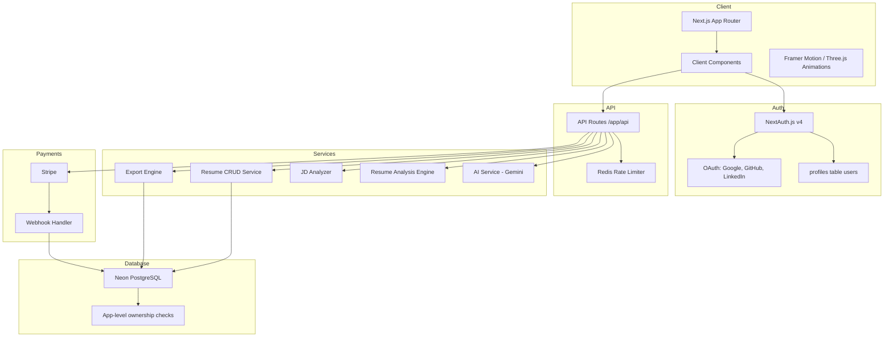

<div align="center">

# AI Resume Builder & Analyzer

**Build, analyze, and optimize resumes with AI assistance.**

[](https://nextjs.org/)
[](https://www.typescriptlang.org/)
[](https://tailwindcss.com/)
[](https://neon.tech/)
[](https://next-auth.js.org/)
[](https://stripe.com/)
[](https://ai.google.dev/)
[](https://pnpm.io/)
[]()
[]()
[](CONTRIBUTING.md)
[](CODE_OF_CONDUCT.md)

[Features](#features) • [Architecture](#architecture) • [Getting Started](#getting-started) • [API Documentation](#api-documentation) • [Testing](#testing) • [Deployment](#deployment)

</div>

---

## Table of Contents

- [Features](#features)
- [Tech Stack](#tech-stack)
- [Architecture](#architecture)
- [Folder Structure](#folder-structure)
- [Getting Started](#getting-started)
  - [Prerequisites](#prerequisites)
  - [Installation](#installation)
  - [Environment Variables](#environment-variables)
  - [Database Setup](#database-setup)
  - [Running Locally](#running-locally)
  - [Available Scripts](#available-scripts)
  - [Build & Production](#build--production)
- [Deployment](#deployment)
- [API Documentation](#api-documentation)
- [Usage Examples](#usage-examples)
- [Testing](#testing)
- [Linting](#linting)
- [Security Notes](#security-notes)
- [Performance Optimizations](#performance-optimizations)
- [Troubleshooting](#troubleshooting)
- [Roadmap](#roadmap)
- [Known Issues](#known-issues)
- [Contributing](#contributing)
- [License](#license)
- [Acknowledgements](#acknowledgements)

---

## Features

### ✍️ AI-Powered Resume Builder
- **Smart Writing Assistant** — AI generates professional summaries, enhances bullet points, checks grammar, and suggests achievements using Google Gemini 2.0 Flash. Anti-hallucination prompts forbid fabricating metrics.
- **11 Original Templates** — Modern, ATS Professional, Student, Minimal, Executive, Creative, Executive Sidebar, Card Modern, Graduate CV, Classic Academic, and Deedy, each with its own layout, accent, and font (formerly 55+ duplicate color variants and an imported catalog were removed). A template recommendation engine suggests the best fit for a target job description.
- **GitHub Auto-Import** — Connect GitHub, import repositories (with AI-suggested project summaries), poll contributions, and surface trending repos.
- **LinkedIn Import** — Paste a LinkedIn profile to auto-fill sections, plus manual additions (certificates, achievements, post references).
- **AI Application Kit** — From one job description: customized resume, cover letter, recruiter email, LinkedIn message, interview questions, and skill gaps in a single workflow.

### 🔍 Resume Analysis & Optimization
- **ATS Scoring Engine** — A hybrid engine scores resumes across keyword relevance, readability, formatting, section completeness, and contact info — with a deep ATS variant for stricter parsing.
- **ATS Check Page** — Tabbed analysis report (score, keywords, bullets, grammar, formatting, repetition) with one-click fixes: add missing keywords, rewrite weak bullets, and apply safe grammar/style fixes.
- **Job Description Matching** — Paste a JD to extract keywords, identify skill gaps, and get a match percentage.
- **Resume File Upload** — Upload PDF, DOCX, or TXT; the parser extracts text, sections, email, phone, and links automatically.
- **Grammar & Strength Analysis** — Built-in grammar checker and strength report with actionable recommendations.

### 🔄 Resume Variants & Sharing
- **Role-Tailored Versions** — Rewrite your resume to emphasize skills relevant to a specific role type.
- **Company-Culture Versions** — Tailor your resume to match different company cultures (startup, enterprise, agency, etc.).
- **Public Share Links** — Share any resume via an unguessable token link (tracks view counts).

### 📤 Multi-Format Export
- **PDF** — Server-rendered PDF from the same React templates used in the builder.
- **DOCX** — Word document generation for further editing.
- **HTML & TXT** — Copy-paste friendly formats.
- **ATS Analyzer Export** — Download full ATS reports (JSON/CSV).

### 🗂️ Career Tools
- **Job Tracker** — Manage applications with statuses, interview rounds, and outcomes.
- **Resume Updates Feed** — GitHub-backed "recently updated" stream with repo stats; apply/ignore suggestions.
- **Notifications** — Email + in-app notifications for key events.
- **Admin Console** — User management, platform stats, prompt management, template catalog, and an audit log.
- **Analytics** — Platform-level dashboards for admins.

### 💳 Subscription Plans
| Plan | Price | Key Limits |
|------|-------|------------|
| **Free** | $0 | 1 resume, 20 AI actions/mo, 3 ATS checks, 3 JD analyses, basic templates |
| **Pro** | $12/mo or $90/yr | Unlimited resumes & AI actions, all templates, PDF export, GitHub sync, cover letters, priority support |

Stripe handles payments, webhooks, and the customer portal. Usage limits reset monthly.

---

## Tech Stack

| Layer | Technology |
|-------|-----------|
| **Framework** | [Next.js 15](https://nextjs.org/) (App Router, React 19) |
| **Language** | [TypeScript](https://www.typescriptlang.org/) 5.9 (strict) |
| **Styling** | [Tailwind CSS](https://tailwindcss.com/) 3.4 + custom design tokens, dark mode |
| **Database** | [PostgreSQL](https://www.postgresql.org/) via [Neon](https://neon.tech/) |
| **Authentication** | [NextAuth.js](https://next-auth.js.org/) 4.24 (JWT strategy) — self-hosted users in the `profiles` table |
| **Auth Providers** | Google OAuth, GitHub OAuth, Email/Password (credentials) |
| **AI Engine** | [Google Gemini 2.0 Flash](https://ai.google.dev/) |
| **Payments** | [Stripe](https://stripe.com/) (checkout, subscriptions, webhooks, customer portal) |
| **Rate Limiting** | Redis (`ioredis`) with an in-memory fallback when `REDIS_URL` is unset |
| **Animation** | [Framer Motion](https://www.framer.com/motion/) + GSAP + Three.js (3D hero) |
| **Icons** | [Lucide React](https://lucide.dev/) + [React Icons](https://react-icons.github.io/react-icons/) |
| **Document Parsing** | `mammoth` (DOCX), `pdf-parse` (PDF) |
| **Export** | `@react-pdf/renderer` (PDF), `docx` (DOCX), custom HTML/TXT renderers |
| **Linting** | ESLint 9 flat config (`eslint.config.mjs`) |
| **Testing** | [Vitest](https://vitest.dev/) 3 (36 test files, 475 tests) |
| **Monitoring** | Sentry (client, server, edge) |
| **Runtime** | Node.js 22 (`.nvmrc`) |
| **Package Manager** | [pnpm](https://pnpm.io/) 11 (workspace + `allowBuilds` config) |

---

## Architecture


```mermaid
graph TB
    subgraph Client
        A[Next.js App Router]
        B[Client Components]
        C[Framer Motion / Three.js Animations]
    end

    subgraph Auth
        D[NextAuth.js v4]
        E[profiles table users]
        F[OAuth: Google, GitHub, LinkedIn]
    end

    subgraph API
        G[API Routes /app/api]
        H[Redis Rate Limiter]
    end

    subgraph Services
        I[AI Service - Gemini]
        J[Resume Analysis Engine]
        K[JD Analyzer]
        L[Resume CRUD Service]
        M[Export Engine]
    end

    subgraph Database
        N[Neon PostgreSQL]
        O[App-level ownership checks]
    end

    subgraph Payments
        P[Stripe]
        Q[Webhook Handler]
    end

    A --> B
    B --> D
    D --> E
    D --> F
    B --> G
    G --> H
    G --> I
    G --> J
    G --> K
    G --> L
    G --> M
    L --> N
    M --> N
    N --> O
    G --> P
    P --> Q
    Q --> N
```

### Design Patterns

- **Service Layer** — Business logic is isolated in `src/services/`. API routes are thin wrappers that authenticate, validate, call services, and return JSON.
- **Feature Modules** — Each feature (auth, resume-builder, ai-assistant, subscription, export, ats, github, linkedin) lives in `src/features/<name>/` with its own components, hooks, and API clients.
- **Server vs. Client Separation** — Server components and API routes use `@/lib/db/server.ts` (a Postgres query client); no browser-side database client exists — mutations go through API routes.
- **Single Resume Mapper** — All DB→client resume mapping flows through `src/services/resume/mapper.ts` (`mapRowToResumeData`), shared by the CRUD service and the public share page.
- **JWT Session Strategy** — NextAuth.js manages sessions via JWT tokens; `src/middleware.ts` protects routes behind authentication.
- **Ownership Enforced in Code** — There is no Row-Level Security (plain Neon Postgres). Every query is scoped to the authenticated user id from the NextAuth session, so users can only access their own rows.
- **Rate Limiting** — AI and sensitive API calls are rate-limited per user/IP via Redis (with a fail-closed in-memory fallback).
- **Anti-Hallucination Prompts** — All AI prompts explicitly forbid fabricating metrics, experience, or skills. System prompts live in `src/services/ai/prompts.ts` and are admin-overridable via the `prompts` table.
- **Feature-Gated Subscriptions** — Plan limits (`maxResumes`, `maxAiActions`, `hasAdvancedTemplates`, etc.) are enforced server-side, not just in the UI.

---

## Folder Structure

```
ai-resume-builder-and-analyzer/
├── next.config.mjs              # Next.js config (image domains, Sentry, headers)
├── tailwind.config.js            # Custom design tokens (colors, typography, shadows)
├── tsconfig.json                 # TypeScript strict config (@/ → ./src/)
├── eslint.config.mjs             # ESLint 9 flat config
├── vitest.config.ts              # Vitest test configuration
├── .nvmrc                        # Node 22
├── .env.example                  # All required + optional environment variables
├── package.json
│
├── db/
│   ├── schema.sql                  # Idempotent schema + seeds (SAFE to re-run)
│   ├── reset.sql                   # DESTRUCTIVE drops — run only via pnpm db:reset
│   └── reset.sh                    # Guarded reset runner (requires confirmation)
│
├── scripts/
│   └── db-generate-types.mjs       # Generates src/lib/db/types.ts from db/schema.sql
│
└── src/
    ├── middleware.ts              # Route protection via NextAuth withAuth
    ├── providers.tsx              # SessionProvider + theme/notification providers
    │
    ├── types/                     # Shared TypeScript interfaces
    │   ├── resume.ts              # ResumeData, Education, Experience, sections…
    │   ├── user.ts                # UserProfile, CareerGoal, UserType
    │   ├── ai.ts                  # AiAction, AiRequest, AiResponse, AnalysisResult
    │   └── api.ts                 # ApiResponse<T>, PaginatedResponse<T>
    │
    ├── lib/                       # Shared configuration and utilities
    │   ├── auth.ts                # NextAuth options (providers, callbacks, pages)
    │   ├── validation.ts          # Zod schemas for every API payload
    │   ├── rate-limit.ts          # Redis rate limiter (in-memory fallback)
    │   ├── stripe.ts              # Stripe client + plan definitions
    │   ├── subscription.ts        # Plan limits enforcement
    │   ├── encryption.ts          # AES-256-GCM token encryption (GitHub/LinkedIn)
    │   ├── env-validator.ts       # Fail-fast environment validation
    │   ├── api.ts                 # Shared error handling helpers
    │   ├── admin.ts / admin-emails.ts
    │   ├── fetch-url.ts           # SSRF guard for URL fetching
    │   ├── db/
    │   │   ├── connection.ts      # Neon Postgres pool (DATABASE_URL)
    │   │   ├── schema.ts          # information_schema introspection cache
    │   │   ├── query-builder.ts   # PostgREST-style query builder over SQL
    │   │   ├── server.ts          # Server query client (SSR-compatible)
    │   │   ├── admin.ts           # Service-level client (admin + webhooks)
    │   │   └── types.ts           # Database types (profiles = user store)
    │   └── password.ts            # bcrypt hashing + reset-token helpers
    │
    ├── services/                  # Business logic (thin API routes call these)
    │   ├── ai/                    # Gemini client, prompts, output guard
    │   ├── resume/                # CRUD service, mapper, completion, bullet-matcher
    │   ├── resume-analyzer/       # Parser, ATS scorer, deep-ATS, grammar, strength
    │   ├── jd-analyzer/           # JD keyword extraction, skill-gap analysis
    │   ├── export/                # PDF (React), DOCX, HTML, TXT generators
    │   ├── applications/          # Job tracker service
    │   ├── resume-updates/        # GitHub-backed updates feed
    │   ├── github/                # GitHub sync + token handling
    │   ├── templates/             # Template catalog service
    │   ├── notifications/         # Email + in-app notifications
    │   └── projects/              # AI project suggestions
    │
    ├── features/                  # Feature modules
    │   ├── auth/                  # Login, sign-up, OAuth, useAuth hook
    │   ├── resume-builder/        # Builder form, workspace, templates, setup dialog
    │   ├── ai-assistant/          # Panel, context, API client
    │   ├── ats-check/             # ATS check report components (tabs, shared UI)
    │   ├── export/                # Export dialogs & buttons
    │   ├── subscription/          # Upgrade dialog, usage hook
    │   ├── theme/                 # Dark mode provider
    │   ├── github/ linkedin/      # Integration pages
    │   ├── dashboard/             # Dashboard cards, recommendations
    │   ├── variants/ cover-letter/ jd-analyzer/ onboarding/
    │
    └── app/                       # Next.js App Router (40 pages)
        ├── page.tsx               # Landing page (hero, features, pricing, CTA)
        ├── dashboard/             # Resume list with stored ATS scores
        ├── builder/[resumeId]/    # Resume editor (+ per-section pages)
        ├── ats-check/             # ATS check page (components in src/features/ats-check/)
        ├── templates/             # Template gallery (AI recommendation)
        ├── jobs/                  # Job tracker
        ├── updates/               # Resume updates feed
        ├── analytics/             # Admin analytics
        ├── admin/                 # Users, stats, prompts, templates, audit log
        ├── tools/                 # application-kit, cover-letter, job-match
        ├── integrations/          # GitHub, LinkedIn
        ├── share/[token]/         # Public resume share page
        ├── pricing/ settings/ preview/ resume/[resumeId]/…
        └── api/                   # 57 REST routes
            ├── auth/ ai/ resumes/ analyze-jd/ resume-analyze/
            ├── ats-analyze/ ats-score/[resumeId]/
            ├── templates/ templates/recommend/
            ├── export/[resumeId]/ data-export/
            ├── github/ linkedin/ stripe/ admin/
            ├── applications/ resume-updates/ notifications/ search/
            ├── projects/suggest/ health/ cron/github-poll/
            └── …
```

---

## Getting Started

### Prerequisites

- **Node.js 22+** (`.nvmrc` pins Node 22 — pnpm 11 requires ≥ 22.13)
- **pnpm 11** — enable via `corepack enable` (pnpm is not npm)
- **Neon** PostgreSQL database (free tier — [neon.tech](https://neon.tech))
- **Google Gemini API key** (free tier — [ai.google.dev](https://ai.google.dev))
- **GitHub OAuth App** — [Register here](https://github.com/settings/developers)
- **Google OAuth Client** — [Create in GCP Console](https://console.cloud.google.com/apis/credentials)
- **Stripe account** (optional for subscriptions — [stripe.com](https://stripe.com))
- **Redis** (optional — falls back to in-memory rate limiting)

### Installation

```bash
# Clone the repository
git clone https://github.com/Khushi-agarwal1401/AI-Resume-Builder-and-Analyzer.git
cd AI-Resume-Builder-and-Analyzer

# Use the correct Node version
nvm use          # Node 22 (see .nvmrc)

# Enable pnpm (Node ≥ 22.13 bundles corepack)
corepack enable

# Install dependencies (frozen = CI-exact)
pnpm install
```

> **Important:** this repository is **pnpm-managed**. CI uses `pnpm install --frozen-lockfile` against `pnpm-lock.yaml`. Do not use `npm install`/`npm ci` — there is no `package-lock.json`.

### Environment Variables

Copy the example environment file and fill in your credentials:

```bash
cp .env.example .env.local
```

| Variable | Required | Description |
|----------|----------|-------------|
| `DATABASE_URL` | ✅ | Neon/Postgres connection string (`postgres://…`) |
| `GEMINI_API_KEY` | ✅ | Google Gemini API key |
| `NEXTAUTH_SECRET` | ✅ | Random string for JWT encryption (`openssl rand -base64 32`) |
| `NEXTAUTH_URL` | ✅ | Application URL (`http://localhost:3000` for dev) |
| `ENCRYPTION_KEY` | ✅ | 32-byte hex key for encrypting OAuth tokens (`openssl rand -hex 32`) |
| `GOOGLE_CLIENT_ID` / `GOOGLE_CLIENT_SECRET` | OAuth | Google OAuth client |
| `GITHUB_CLIENT_ID` / `GITHUB_CLIENT_SECRET` | OAuth | GitHub OAuth client |
| `LINKEDIN_CLIENT_ID` / `LINKEDIN_CLIENT_SECRET` | Optional | LinkedIn OAuth client |
| `STRIPE_SECRET_KEY` | Payments | Stripe secret key (`sk_test_…`) |
| `STRIPE_WEBHOOK_SECRET` | Payments | Stripe webhook signing secret (`whsec_…`) |
| `STRIPE_PRO_PRICE_ID_MONTHLY` / `_YEARLY` | Payments | Stripe price IDs for Pro |
| `NEXT_PUBLIC_STRIPE_PRO_PRICE_ID_MONTHLY` / `_YEARLY` | Payments | Public Pro price IDs |
| `REDIS_URL` (or `REDIS_HOST`/`REDIS_PORT`) | Optional | Redis for rate limiting; falls back to in-memory |
| `RESEND_API_KEY` | Optional | Resend API key for password-reset emails (`api_resend_…`) |
| `PROXYCURL_API_KEY` | Optional | Proxycurl API key for LinkedIn profile import (free tier ~10 credits/month) |
| `RESEND_FROM_EMAIL` | Optional | Resend sender address (defaults to `onboarding@resend.dev`) |
| `ADMIN_EMAILS` | Admin | Comma-separated emails with admin access |
| `ALLOWED_ORIGINS` | Optional | CORS allowlist for public endpoints |
| `SENTRY_ORG` / `SENTRY_PROJECT` / `SENTRY_AUTH_TOKEN` / `NEXT_PUBLIC_SENTRY_DSN` | Optional | Sentry error monitoring |

> **Note:** OAuth providers are optional — email/password signup always works. Stripe is optional — without it, all users get the Free plan. Password-reset emails are optional — without `RESEND_API_KEY`, reset requests are logged and the account simply has no email sent.

### Database Setup

The app uses a plain PostgreSQL database hosted on [Neon](https://neon.tech/). Create a Neon project, copy its connection string into `DATABASE_URL`, then apply the schema:

```bash
pnpm db:migrate   # psql "$DATABASE_URL" -f db/schema.sql
```

`db/schema.sql` is **idempotent and non-destructive**: tables are created with
`CREATE TABLE IF NOT EXISTS`, indexes with `CREATE INDEX IF NOT EXISTS`, and
seeds with `ON CONFLICT DO NOTHING` — so re-running it against a database with
live data is always safe. It never drops tables and never alters existing rows.
(Old versions of this file dropped and recreated every table; that behavior
now lives exclusively behind `pnpm db:reset`.)

To **fully reset** a local/throwaway database (this deletes all data):

```bash
pnpm db:reset                          # prompts for confirmation first
DB_RESET_CONFIRM=yes pnpm db:reset     # non-interactive (CI/scripts)
```

Never run `db:reset` against a database with data you need.

> If the schema re-apply step of `db:reset` ever fails, the database is left
> without tables — re-run `pnpm db:migrate` to rebuild them.

**Typed DB client:** `src/lib/db/types.ts` is **auto-generated** from
`db/schema.sql` — never edit it by hand. Whenever the schema changes, run:

```bash
pnpm db:gen-types
```

CI enforces that the two never drift via `pnpm db:check-types`.

Auth is entirely self-hosted: the `profiles` table stores users (including `password_hash` for email/password login) and NextAuth handles sessions via JWT.

### Running Locally

```bash
pnpm run dev
```

Open [http://localhost:3000](http://localhost:3000) in your browser.

### Available Scripts

| Script | Command | Description |
|--------|---------|-------------|
| `dev` | `next dev --turbo` | Start development server with Turbopack |
| `build` | `next build` | Production build (type-checks + lints) |
| `start` | `next start` | Start production server |
| `lint` | `eslint . --max-warnings 200` | Run ESLint across the project |
| `test` | `vitest run` | Run the test suite once |
| `test:watch` | `vitest` | Run tests in watch mode |
| `db:migrate` | `psql … -f db/schema.sql` | Apply idempotent schema + seeds (non-destructive, safe to re-run) |
| `db:reset` | `bash db/reset.sh` | ⚠ DROP ALL TABLES & DATA, then re-apply schema (requires confirmation) |
| `db:gen-types` | `node scripts/db-generate-types.mjs` | Regenerate `src/lib/db/types.ts` from `db/schema.sql` |
| `db:check-types` | `node scripts/db-generate-types.mjs --check` | Fail if DB types drifted from schema (CI gate) |

### Build & Production

```bash
# Build the application
pnpm run build

# Start the production server
pnpm run start
```

---

## Deployment

### Vercel (Recommended)

1. Push the repository to GitHub.
2. Import the project in Vercel (it detects Next.js + pnpm automatically).
3. **Database:** Apply the schema to your Neon Postgres database first:
   ```bash
   pnpm db:migrate
   ```
   (`pnpm db:migrate` is idempotent — safe to re-run on an existing database.)
4. **Environment variables:** Set every variable from `.env.example` in the
   Vercel dashboard. Minimum required set:
   ```
   DATABASE_URL          # Neon connection string
   NEXTAUTH_SECRET       # `openssl rand -base64 32`
   NEXTAUTH_URL          # https://<your-vercel-domain>
   GEMINI_API_KEY        # Google Gemini API key
   ENCRYPTION_KEY        # `openssl rand -hex 32`
   ADMIN_EMAILS          # Comma-separated admin emails
   CRON_SECRET           # Random string for cron authentication
   ```
   OAuth/GitHub/LinkedIn/Stripe/Sentry/Resend keys are optional — the app
   works without them, but the corresponding features are disabled.
5. **Deploy.** The app auto-detects pnpm 11 (via `packageManager` in
   `package.json`) and builds with `pnpm build`. No `vercel.json` is strictly
   required, but one is shipped for the daily GitHub-poll cron (see below).

#### Vercel Cron (GitHub auto-detect)

The `vercel.json` in the repo registers a daily cron at `/api/cron/github-poll`
(schedule: `0 2 * * *`). Vercel sends `Authorization: Bearer <CRON_SECRET>` to
that endpoint; the value of `CRON_SECRET` must match the env var you set.
Without this cron, the "resume updates" tab only refreshes when users manually
click "check for updates". The cron is safe to ignore if you do not use the
GitHub sync feature.

#### Serverless function duration

OCR-heavy endpoints (`/api/resumes/import`, `/api/ats-analyze`,
`/api/resume-analyze`) and the PDF export route (`/api/export/[resumeId]`) set
`export const maxDuration = 300` to avoid timeouts on large PDFs. The Hobby plan
under Fluid Compute permits up to 300 s, the Pro plan up to 800 s.

#### Redis / BullMQ

- **Rate limiting** uses Redis when `REDIS_URL` is set, or falls back to
  in-memory when unset. Both work on Vercel.
- **Background jobs** (ATS async mode): with `REDIS_URL` unset, jobs run inline
  (no worker needed). With `REDIS_URL` set, jobs are queued via BullMQ — but
  the standalone worker (`pnpm worker`) is a long-running process that cannot
  run on Vercel serverless. If you set `REDIS_URL` on Vercel, async-mode ATS
  jobs will remain queued forever. The default **sync mode** still runs inline
  regardless of Redis, so most functionality is unaffected.
- **Upstash Redis** is fully compatible — set `REDIS_URL` to the TLS endpoint:
  `rediss://default:<token>@<host>.upstash.io:6379`.

#### OAuth callback URLs

If you configure Google/GitHub/LinkedIn sign-in, add the following callback
URLs to each provider's dashboard (replace `<domain>` with your Vercel URL):
```
https://<domain>/api/auth/callback/google
https://<domain>/api/auth/callback/github
https://<domain>/api/auth/callback/linkedin
```

### Other Platforms

Any Node.js 22+ hosting platform (Railway, Render, Netlify, etc.):

1. Build: `pnpm run build`
2. Start: `pnpm run start`
3. Configure all environment variables on the platform.

---

## API Documentation

### Authentication

```
POST /api/auth                   Sign up a new user
PUT  /api/auth                   Update user profile (authenticated)
GET  /api/auth/[...nextauth]     NextAuth.js handlers (GET/POST)
```

### Resumes

```
GET    /api/resumes               List user's resumes (includes stored ATS score)
POST   /api/resumes               Create a resume (profile pre-fill unless prefill:false)
GET    /api/resumes/:id           Get resume with all sections
PUT    /api/resumes/:id           Update resume or sections (autosave)
PATCH  /api/resumes/:id           Update sections (LinkedIn import)
DELETE /api/resumes/:id           Delete resume
POST   /api/resumes/:id/duplicate Duplicate a resume
POST   /api/resumes/:id/share     Enable/disable public share link
POST   /api/resumes/:id/add-keywords       Add missing JD keywords
POST   /api/resumes/:id/apply-bullets      Apply AI bullet rewrites
POST   /api/resumes/:id/apply-grammar      Apply safe grammar/style fixes
POST   /api/resumes/import        Import from pasted text / uploaded file
```

### AI Assistant

```
POST /api/ai    AI proxy (rate-limited, Redis-backed)
```

```json
{ "action": "enhance-bullet", "input": "Made website faster", "context": "Built with React" }
```

<details>
<summary><strong>Supported AI Actions</strong></summary>

| Action | Description |
|--------|-------------|
| `generate-summary` | Generate a professional summary |
| `enhance-bullet` | Improve a bullet point with action verbs |
| `check-grammar` | Fix grammar and spelling |
| `suggest-achievements` | Suggest quantifiable achievements |
| `add-keywords` | Identify missing keywords from a JD |
| `rewrite-section` | Rewrite a section for impact |
| `cover-letter` | Generate a cover letter |
| `ats-score` | Calculate an ATS compatibility score |
| `analyze-jd` | Compare resume against a job description |
| `company-variant` / `role-variant` | Tailor resume to a company culture / role |
| `profile-improvement` | Suggest profile/onboarding improvements |
| `github-repo-suggest` | Suggest GitHub projects to feature |
| `recruiter-email` / `linkedin-message` / `interview-questions` | Application Kit actions |

</details>

### Resume Analysis

```
POST /api/resume-analyze       Analyze resume text or an uploaded file
POST /api/ats-analyze          Full ATS check (score, keywords, bullets, grammar, formatting)
GET  /api/ats-analyses         Analysis history
GET  /api/ats-score/:resumeId  Stored ATS score for a resume
```

### Job Description

```
POST /api/analyze-jd    Analyze a JD against a resume
GET  /api/analyze-jd    Analysis history (?resumeId=xxx)
```

### Templates

```
GET  /api/templates          List the template catalog
POST /api/templates/recommend  AI template recommendation (deterministic fallback)
```

### Export

```
GET /api/export/:resumeId?format=pdf|docx|html|txt   Export a resume
GET /api/data-export?type=ats                        Download ATS reports (JSON/CSV)
```

### Integrations

```
GET  /api/github/connect            Redirect to GitHub OAuth
POST /api/github/connect            Exchange code for token
GET  /api/github/repos|contributions|trending|suggest
POST /api/github/import-username    Import a GitHub username's repos
POST /api/github/poll               Poll GitHub for resume updates
GET  /api/linkedin/connect          LinkedIn OAuth
POST /api/linkedin/manual-add       Add a certificate/achievement manually
```

### Applications (Job Tracker)

```
GET/POST /api/applications        List / create applications
PUT/DELETE /api/applications/:id  Update (incl. interview rounds, outcomes) / delete
```

### Resume Updates

```
GET  /api/resume-updates          List update suggestions
PUT  /api/resume-updates/:id      Mark as added/ignored
```

### Subscription / Stripe

```
GET  /api/stripe/checkout     Get subscription status
POST /api/stripe/checkout     Create a checkout session
GET  /api/stripe/portal       Get the customer portal URL
POST /api/stripe/webhook      Stripe webhook handler (idempotent)
```

### Admin

```
GET  /api/admin/users | /api/admin/users/:id    User management (admin-only)
GET  /api/admin/stats                           Platform statistics
GET  /api/admin/prompts | POST /api/admin/prompts  AI prompt management
GET/POST/PUT /api/admin/templates               Template catalog management
GET  /api/admin/audit                           Admin audit log
```

### Health

```
GET /api/health    Health check (used by uptime monitors)
```

> **Admin access** is restricted to the emails listed in `ADMIN_EMAILS`.

---

## Usage Examples

### Creating a resume programmatically

```bash
curl -X POST http://localhost:3000/api/resumes \
  -H "Content-Type: application/json" \
  -H "Cookie: next-auth.session-token=..." \
  -d '{"title": "Senior Frontend Resume", "template": "ats-professional"}'
```

### Analyzing a resume file

```bash
curl -X POST http://localhost:3000/api/resume-analyze \
  -H "Cookie: next-auth.session-token=..." \
  -F "file=@resume.pdf"
```

### Running an AI action

```bash
curl -X POST http://localhost:3000/api/ai \
  -H "Content-Type: application/json" \
  -H "Cookie: next-auth.session-token=..." \
  -d '{"action": "generate-summary", "input": "Full stack developer with 5 years experience", "context": "React, Node.js, PostgreSQL"}'
```

### One-click ATS improvements

```bash
curl -X POST http://localhost:3000/api/resumes/<id>/add-keywords \
  -H "Content-Type: application/json" -H "Cookie: next-auth.session-token=..." \
  -d '{"keywords": ["TypeScript", "GraphQL"]}'

curl -X POST http://localhost:3000/api/resumes/<id>/apply-bullets \
  -H "Content-Type: application/json" -H "Cookie: next-auth.session-token=..." \
  -d '{"bullets": [{"original": "Improved performance", "rewrite": "Cut page load time by 38% via code splitting"}]}'
```

### Exporting a resume

```bash
curl -o resume.pdf "http://localhost:3000/api/export/<id>?format=pdf" \
  -H "Cookie: next-auth.session-token=..."
```

---

## Testing

The project has a real, growing test suite built on **Vitest** — **36 test files with 475 passing tests**. Run it with:

```bash
# Run the full suite once
pnpm test

# Watch mode
pnpm test:watch

# A single file
pnpm test src/services/resume/mapper.test.ts
```

### What's covered

| Area | Files |
|------|-------|
| **Resume service** | `service.test.ts` (29 tests: CRUD, profile pre-fill, theme columns, PGRST204 retry, section writes) |
| **Resume mapper** | `mapper.test.ts` (13 tests: section_order, custom_sections, accent color, section coercion) |
| **Bullet matcher** | `bullet-matcher.test.ts` (23 tests: exact + fuzzy matching, dedupe) |
| **ATS engine** | `ats-scorer.test.ts` (22) + `deep-ats.test.ts` (6): scoring dimensions, URL sanitization, domain matching |
| **Parser & grammar** | `parser.test.ts`, `grammar-checker.test.ts` |
| **AI guard** | `guard.test.ts`: injection/XSS prompt filtering |
| **Export generators** | `export-generators.test.ts`, `pdf-templates.test.tsx` |
| **API routes** | `route.test.ts` files (auth, resumes, apply-bullets, import, settings) |
| **Notifications** | `email.test.ts` |

### CI

GitHub Actions runs lint, type-check, and tests on Node 22 (Node 24 experimental) for every PR, plus PR-quality checks (title format, auto-labeling, description warnings). All checks must pass before merge:

```bash
pnpm run lint       # ESLint (0 errors)
pnpm exec tsc --noEmit   # Type check (0 errors)
pnpm test           # 475 tests
```

---

## Linting

```bash
# Run ESLint
pnpm run lint
```

ESLint 9 uses a flat config (`eslint.config.mjs`) with:
- `@next/eslint-plugin-next` — Next.js recommended + core-web-vitals rules
- `typescript-eslint` — TypeScript-aware rules (unused vars, explicit `any` as warnings)

No Prettier is configured — formatting is handled by ESLint conventions.

---

## Security Notes

- **Ownership Enforced in Code** — Plain Postgres (no RLS); every query is scoped to the authenticated user id from the NextAuth session.
- **JWT Sessions** — NextAuth.js signs session JWTs with `NEXTAUTH_SECRET`.
- **Rate Limiting** — AI and sensitive endpoints are rate-limited per user/IP via Redis (fail-closed in-memory fallback).
- **Token Encryption** — GitHub/LinkedIn OAuth tokens are encrypted at rest with AES-256-GCM (`ENCRYPTION_KEY`).
- **Anti-Hallucination** — All AI prompts forbid fabricating metrics, experience, or skills.
- **SSRF Guard** — Outbound URL fetches (`fetch-url.ts`) reject private/loopback addresses.
- **Input Validation** — Every API route validates its payload with Zod schemas (`src/lib/validation.ts`).
- **Safe Error Messages** — API responses never leak internal error details, secrets, or DB errors.
- **Stripe Webhook Verification** — Webhooks are signature-verified and processed idempotently (`webhook_events` ledger).
- **Security Headers** — CSP and other headers are set via `next.config.mjs`.
- **Admin Audit Log** — Admin mutations are recorded in `admin_audit_log`.

### ⚠️ Git History Warning

If this repository was cloned from a version where secrets were previously hardcoded or committed in `.env` files, those old values may still exist in git history even after deletion.

**If you have ever committed a real API key, password, or token to this repository, rotate (regenerate) that credential immediately** — including the database connection string, Gemini key, Stripe keys, OAuth client secrets, `NEXTAUTH_SECRET`, and `ENCRYPTION_KEY`.

To check for secrets in history:
```bash
git log --all --full-history -- '*.env*'
git log --all --full-history --diff-filter=A -- '*.ts' | head -100
```

---

## Performance Optimizations

- **Server-Side Query Client** — Server components use a dedicated Postgres query client; a single batched query loads a resume with all 12 sections in one round trip.
- **Redis Rate Limiting** — Shared, distributed rate limiting (in-memory fallback keeps dev simple).
- **React 19 + Server Components** — Most pages render server-side; the builder is client-side where interactivity requires it.
- **Memoized Renderer** — `MemoTemplateRenderer` avoids re-rendering templates on unrelated state changes.
- **Debounced Autosave** — Builder autosave is debounced and rate-limited to ~1 write/second.
- **Tailwind JIT** — Only used styles are included in the production bundle.
- **Path Aliases** — `@/` maps to `./src/` for clean imports.
- **Image Optimization** — Next.js Image configured for Google/GitHub avatar domains.
- **Database Indexes** — The consolidated schema includes targeted indexes (user_id, resume_id, share_token, etc.).

---

## Troubleshooting

| Problem | Likely Cause | Solution |
|---------|-------------|----------|
| `DATABASE_URL not configured` | `.env.local` not set | `cp .env.example .env.local`, add your Neon connection string, then `pnpm db:migrate` |
| `GEMINI_API_KEY not configured` | Missing API key | Get a free key from [ai.google.dev](https://ai.google.dev) |
| `Unauthorized` on API routes | No valid session | Sign in first, or check NextAuth callbacks |
| `Rate limit exceeded` | Too many AI calls | Wait, or upgrade to Pro |
| pnpm errors on install | Wrong package manager | This repo is pnpm-only — do not run `npm ci` |
| pnpm requires newer Node | Node < 22.13 | `nvm use` (`.nvmrc` pins Node 22) |
| `Stripe not configured` | Missing Stripe keys | Set `STRIPE_SECRET_KEY` and price IDs |
| `Forbidden` on admin routes | Email not whitelisted | Add the email to `ADMIN_EMAILS` |
| `Invalid signature` on webhook | Wrong webhook secret | Verify `STRIPE_WEBHOOK_SECRET` matches Stripe dashboard |
| Build fails with type errors | Type mismatch | Run `pnpm exec tsc --noEmit` |
| `@internal/…` module not found | Local `packages/` experiments | Gitignored — not part of the app; excluded from tsconfig |

---

## Roadmap

### Recently Shipped
- **ATS Check page** with one-click fixes (keywords, bullets, grammar)
- **Application Kit** (recruiter email, LinkedIn message, interview questions)
- **AI template recommendation** in the template wizard
- **Multi-format export** (PDF, DOCX, HTML, TXT)
- **Resume sharing** with view counts + QR codes
- **Job tracker** with interview rounds and outcomes
- **Admin console** (users, stats, prompts, templates, audit log)
- **Dark mode** and 3D landing hero
- **Resume version manager** — fork/diff/rollback snapshots
- **Reference Manager** — store references and export
- **Bulk resume tailoring**, **Skill-Gap Radar**, **AI Interview Coach**
- **Quick wins** — resume health score, duplicate, export history

### In Progress / Planned
- **GitHub Deep Integration** — richer contribution graphs, commit history, language stats
- **Analytics Dashboard** — application success rates, interview conversion metrics
- **Multi-language resume support**
- **AI-powered interview question predictions** (per-JD)
- **LinkedIn bidirectional sync**
- **Team/collaboration features** for career coaches

---

## Known Issues

- **LinkedIn OAuth full sync** — profile import via paste works; full OAuth-scoped sync is blocked by LinkedIn's 2015 API shutdown (see the PRD feasibility notice).
- **Local `packages/` experiments** — gitignored work-in-progress that may not type-check; excluded from tsconfig so it doesn't block `tsc --noEmit`.

---

## Contributing

Contributions are welcome! Here's how to get started:

1. **Fork** the repository.
2. **Create a feature branch:** `git checkout -b feat/amazing-feature`.
3. **Commit your changes:** `git commit -m 'feat: add amazing feature'`.
4. **Push:** `git push origin feat/amazing-feature`.
5. **Open a Pull Request** — CI runs lint, type-check, and tests.

### Development Guidelines

- Follow the existing code structure and conventions (feature modules under `src/features/`, services under `src/services/`).
- New features should have their own module in `src/features/`.
- Add TypeScript types for new data structures in `src/types/`.
- API routes validate auth via `getServerSession(authOptions)` and payloads via Zod schemas.
- Database queries go through the service layer.
- AI prompts must include anti-hallucination instructions.
- **Add tests** — services and mappers should have Vitest coverage (see [Testing](#testing)).
- Run `pnpm run lint`, `pnpm exec tsc --noEmit`, and `pnpm test` before pushing.

---

## License

This project is licensed under the **ISC License**. See the [LICENSE](LICENSE) file for details.

---

## Acknowledgements

- Built with [Next.js](https://nextjs.org/) by the Vercel team
- Database hosted on [Neon](https://neon.tech/)
- AI capabilities by [Google Gemini](https://ai.google.dev/)
- Payments by [Stripe](https://stripe.com/)
- Icons by [Lucide](https://lucide.dev/) and [React Icons](https://react-icons.github.io/react-icons/)
- Animations by [Framer Motion](https://www.framer.com/motion/) and GSAP
- 3D graphics by [Three.js](https://threejs.org/)
- Fonts: [Inter](https://rsms.me/inter/) by Rasmus Andersson, [JetBrains Mono](https://www.jetbrains.com/lp/mono/) by JetBrains

---

## Information Needed

The following information could not be inferred from the codebase:

- **Live Demo URL** — no deployed demo URL was found.
- **Maintainer Contact** — no email or contact information in the project files.
- **Changelog / Release History** — no `CHANGELOG.md` or release tags.
